<p align="center">
  <picture>
    <source media="(prefers-color-scheme: dark)" srcset="./sunset.svg">
    
  </picture>
</p>

## Hi, I’m Marsha 

I’m an economist turned software engineer, currently exploring machine learning and AI.

I enjoy building things that are both technically rigorous and genuinely useful. 

---

## 🧠 Currently exploring

- Writing a [series on the JavaScript event loop](https://github.com/marsha-t/javascript-event-loop-explained)  
- Deepening my understanding of machine learning fundamentals  
- Building small products and learning in public  

---

<h3> 💻 Selected Work</h3>

Projects I’ve built across full-stack systems, data analysis, and user-facing products.

| Project | Description | Tech |
|----------|--------------|------|
| [Portfolio Website](https://github.com/marsha-t/marsha-portfolio) |  Personal site with custom markdown pipeline for projects and writing | Next.js, Tailwind |
| [ft_transcendence](https://github.com/marsha-t/ft_transcendence) | Real-time multiplayer web app built with a microservices architecture from scratch  | TypeScript, Fastify, Tailwind, Docker |
| [SkinDiary](https://github.com/marsha-t/SkinDiary) | AI-powered skin and skincare tracker | Flutter, Firebase |
| [Causal Analysis of Pension Deferral Incentives](https://github.com/marsha-t/causal_analysis_incentives) | Policy evaluation using differences-in-differences and regression discontinuity design | Stata |

For a full overview of my 42 projects, see [42-projects](https://github.com/marsha-t/42-projects).


### 🌐 Where to find me
<p><a href="https://github.com/marsha-t" target="_blank"></a> <a href="https://www.linkedin.com/in/marshateo" target="_blank"></a> 
</p>


<h3>⏱️ My Weekly Coding Stats</h3>

<!--START_SECTION:waka-->

```txt
Python       9 hrs 24 mins         █████████████████████▓░░░   86.48 %
Markdown     1 hr 3 mins           ██▒░░░░░░░░░░░░░░░░░░░░░░   09.66 %
Git Config   18 mins               ▓░░░░░░░░░░░░░░░░░░░░░░░░   02.89 %
TypeScript   5 mins                ▒░░░░░░░░░░░░░░░░░░░░░░░░   00.88 %
CSV          0 secs                ░░░░░░░░░░░░░░░░░░░░░░░░░   00.08 %
```

<!--END_SECTION:waka-->

<details>
<summary><h3>🌿 Away From Laptop</h3></summary>

- Practicing Brazilian Jiu-Jitsu 
- Solving jigsaw puzzles 

</details>
